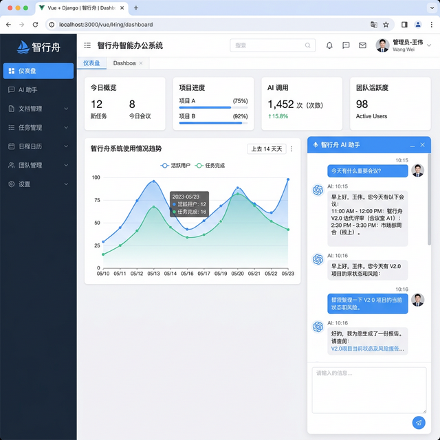
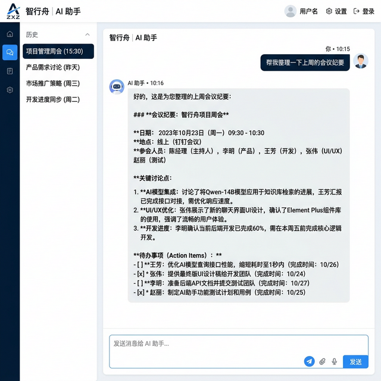
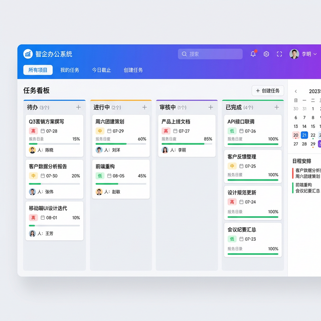
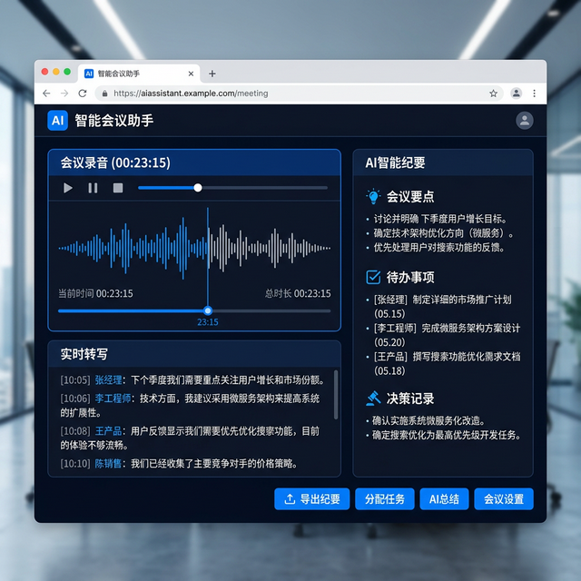
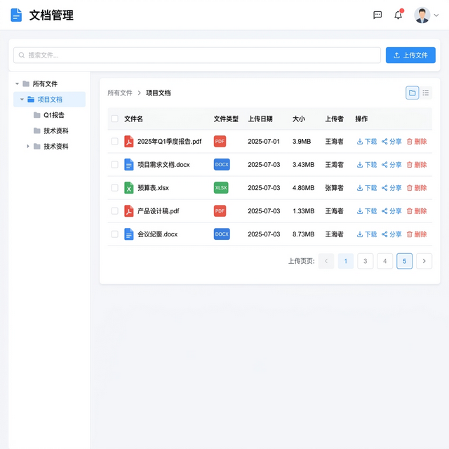
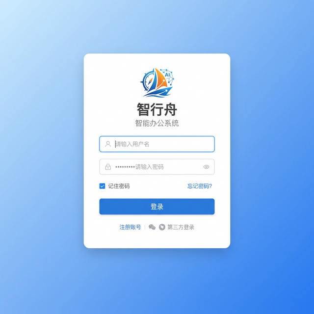

# 智行舟智能办公系统

> 2025 软件杯 B1 赛题 · 基于大语言模型的智能化协同办公平台

## 项目目的

传统办公系统功能割裂，文档管理、即时通讯、任务协同分属不同工具，信息孤岛严重。本系统基于大语言模型（LLM），将 AI 能力深度融入日常办公流程：智能文档处理、AI 对话助手、会议纪要自动生成、任务智能分配，打造一体化智能办公体验。

## 解决的痛点

- 多个办公工具之间数据不互通，切换成本高
- 会议纪要、周报撰写等重复性文字工作耗时
- 文档检索效率低，难以快速定位所需信息
- 任务分配和进度跟踪缺乏智能化辅助

## 系统功能展示

### 系统仪表盘

集中展示待办任务、通知消息、数据统计等核心信息。



### AI 智能对话助手

集成大语言模型的对话界面，支持文档问答、内容生成、数据分析。



### 任务管理看板

看板式任务管理，支持拖拽排序、优先级设置、截止日期提醒。



### AI 会议助手

实时语音转写 + AI 自动生成会议摘要和待办事项。



### 文档管理中心

统一文档存储与管理，支持在线预览和 AI 内容分析。



### 系统登录页

安全的用户认证界面，支持多种登录方式。



## 技术架构

| 层级 | 技术选型 |
|------|---------|
| 前端 | Vue 3 + Element Plus + ECharts |
| 后端 | Spring Boot + MyBatis Plus |
| AI 引擎 | LangChain + OpenAI API |
| 数据库 | MySQL + Redis + MinIO |
| 消息队列 | RabbitMQ |
| 部署 | Docker Compose + Nginx |

## 核心功能

- **AI 对话助手**：基于 LLM 的智能问答，支持上下文理解
- **文档智能处理**：OCR 识别 + AI 摘要 + 关键词提取
- **会议纪要生成**：语音转文字 + 自动生成结构化纪要
- **任务协同管理**：看板视图 + AI 智能分配 + 进度追踪
- **知识库检索**：对企业文档建立向量索引，语义搜索

## 快速开始

```bash
git clone https://github.com/xiaofuqing13/SmartOffice.git
cd SmartOffice

# 后端启动
cd backend && mvn spring-boot:run

# 前端启动
cd frontend && npm install && npm run dev
```

## 开源协议

MIT License
